# 🧠 The Complete Guide to Creating Effective GEMINI.md Files

```mermaid
graph TB
    A[🤖 Generic AI Assistant] --> B[📝 GEMINI.md]
    B --> C[🎯 Project-Aware Collaborator]
    
    A --> D[General Assumptions<br/>Inconsistent Responses<br/>Repetitive Context]
    
    C --> E[Contextual Accuracy<br/>Consistent Patterns<br/>Efficient Workflow]
    
    style A fill:#4a5568,stroke:#68d391,stroke-width:2px,color:#e2e8f0
    style B fill:#2d3748,stroke:#f6ad55,stroke-width:2px,color:#e2e8f0
    style C fill:#1a202c,stroke:#68d391,stroke-width:2px,color:#e2e8f0
    style D fill:#4a5568,stroke:#fc8181,stroke-width:2px,color:#e2e8f0
    style E fill:#1a202c,stroke:#68d391,stroke-width:2px,color:#e2e8f0
```

<div align="center">



</div>

## 📚 Table of Contents
1. [What is GEMINI.md and Why It Matters](#-what-is-geminimd-and-why-it-matters)
2. [Understanding the Hierarchical Memory System](#-understanding-the-hierarchical-memory-system)
3. [Essential Components of a Good GEMINI.md](#-essential-components-of-a-good-geminimd)
4. [Step-by-Step Creation Process](#-step-by-step-creation-process)
5. [Platform-Specific Configurations](#-platform-specific-configurations)
6. [Advanced Techniques and Best Practices](#-advanced-techniques-and-best-practices)
7. [Common Mistakes to Avoid](#-common-mistakes-to-avoid)
8. [Testing and Optimization](#-testing-and-optimization)
9. [Real-World Examples](#-real-world-examples)
10. [Maintenance and Updates](#-maintenance-and-updates)

---

## 🎯 What is GEMINI.md and Why It Matters

<div style="background: linear-gradient(135deg, #667eea 0%, #764ba2 100%); color: white; padding: 25px; border-radius: 15px; margin: 20px 0;">

**🧠 Your Project's AI Memory Bank**

GEMINI.md is a special Markdown file that serves as a **persistent instruction set** for Google's Gemini CLI. Think of it as your project's AI memory bank - it provides context, rules, and guidance that helps Gemini understand your project's unique requirements and maintain consistency across all interactions.

</div>

### ⚠️ Why GEMINI.md is Critical

<div style="display: flex; gap: 20px; margin: 20px 0;">

<div style="flex: 1; background: #ffebee; padding: 20px; border-radius: 10px; border: 2px solid #f44336;">

### ❌ **Without GEMINI.md**
- Inconsistent code style and architecture decisions
- Misaligned responses that don't match your project's goals
- Repetitive explanations of project context
- Generic solutions that don't fit your specific tech stack

</div>

<div style="flex: 1; background: #e8f5e8; padding: 20px; border-radius: 10px; border: 2px solid #4caf50;">

### ✅ **With GEMINI.md**
- **Contextual Accuracy**: Gemini understands your project's purpose and constraints
- **Consistency**: All generated content follows your established patterns
- **Efficiency**: No need to re-explain project basics in every conversation
- **Quality Control**: Built-in guardrails prevent common mistakes

</div>

</div>

---

## 🏗️ Understanding the Hierarchical Memory System

```mermaid
graph TD
    A[🌐 Global Context] --> B[📋 Project Context]
    B --> C[📁 Component Context]
    
    A --> D[~/.gemini/GEMINI.md<br/>Universal Preferences<br/>General Standards]
    
    B --> E[./GEMINI.md<br/>Project-Wide Rules<br/>Tech Stack Info]
    
    C --> F[./subdirectory/GEMINI.md<br/>Specific Module Rules<br/>Component Guidelines]
    
    style A fill:#2d3748,stroke:#81c784,stroke-width:2px,color:#e2e8f0
    style B fill:#2d3748,stroke:#ba68c8,stroke-width:2px,color:#e2e8f0
    style C fill:#2d3748,stroke:#ffb74d,stroke-width:2px,color:#e2e8f0
    style D fill:#1a202c,stroke:#81c784,stroke-width:2px,color:#e2e8f0
    style E fill:#1a202c,stroke:#ba68c8,stroke-width:2px,color:#e2e8f0
    style F fill:#1a202c,stroke:#ffb74d,stroke-width:2px,color:#e2e8f0
```

<div align="center">



</div>

<div style="border-left: 4px solid #2196f3; background: #e3f2fd; padding: 15px; margin: 20px 0;">

Gemini CLI uses a hierarchical approach to load GEMINI.md files, combining context from multiple locations:

**Loading Order (General → Specific):**
1. **Global Context**: `~/.gemini/GEMINI.md`
2. **Project Root**: `./GEMINI.md` (at .git directory level)
3. **Subdirectory**: `./subdirectory/GEMINI.md`

</div>

### 🏗️ Practical Application

<div style="background: #f8f9fa; border: 2px solid #2196f3; border-radius: 10px; padding: 20px; margin: 15px 0;">

```bash
# Global configuration (applies to all projects)
~/.gemini/GEMINI.md

# Project-specific configuration
my-project/
├── .git/
├── GEMINI.md                    # Project-wide rules
├── frontend/
│   └── GEMINI.md               # Frontend-specific rules
└── backend/
    └── api/
        └── GEMINI.md           # API-specific rules
```

</div>

<div style="background: linear-gradient(135deg, #ff9a9e 0%, #fecfef 50%, #fecfef 100%); padding: 20px; border-radius: 10px; margin: 15px 0;">

**🔑 Key Commands:**
- `/memory show` - View combined context from all loaded files
- `/memory refresh` - Reload all GEMINI.md files

</div>

---

## 🧩 Essential Components of a Good GEMINI.md

```mermaid
graph TB
    A[📝 GEMINI.md Architecture] --> B[Six Core Components]
    
    B --> C[🎯 Project Overview]
    B --> D[🛠️ Technology Stack]
    B --> E[🏗️ Architecture Patterns]
    B --> F[📋 Coding Standards]
    B --> G[🔄 Development Workflow]
    B --> H[🤖 AI Collaboration Rules]
    
    style A fill:#2d3748,stroke:#64b5f6,stroke-width:2px,color:#e2e8f0
    style B fill:#2d3748,stroke:#ba68c8,stroke-width:2px,color:#e2e8f0
    style C fill:#1a202c,stroke:#81c784,stroke-width:2px,color:#e2e8f0
    style D fill:#1a202c,stroke:#ffb74d,stroke-width:2px,color:#e2e8f0
    style E fill:#1a202c,stroke:#f06292,stroke-width:2px,color:#e2e8f0
    style F fill:#1a202c,stroke:#aed581,stroke-width:2px,color:#e2e8f0
    style G fill:#1a202c,stroke:#4dd0e1,stroke-width:2px,color:#e2e8f0
    style H fill:#1a202c,stroke:#f8bbd9,stroke-width:2px,color:#e2e8f0
```

<div align="center">



</div>

### 🎯 **1. Project Overview Section**

<div style="background: #e8f5e8; padding: 15px; border-radius: 8px; margin: 15px 0;">

```markdown
# Project Context: [Project Name]

## 1. Project Overview & Purpose
**Primary Goal:** Clear, one-sentence description of what your project does
**Business Domain:** Industry or field (e.g., E-commerce, Fintech, Education)
**Target Audience:** Who uses this project
```

</div>

### 🛠️ **2. Technology Stack Section**

<div style="background: #fff3e0; padding: 15px; border-radius: 8px; margin: 15px 0;">

```markdown
## 2. Core Technologies & Stack
**Languages:** Primary programming languages with versions
**Frameworks & Runtimes:** Major frameworks (React 18, Node.js 20, etc.)
**Databases:** Database systems and their roles
**Key Libraries:** Critical dependencies that define functionality
**Package Manager:** npm, pip, Maven, etc.
```

</div>

### 🏗️ **3. Architecture Documentation**

<div style="background: #ffebee; padding: 15px; border-radius: 8px; margin: 15px 0;">

```markdown
## 3. Architectural Patterns
**Overall Architecture:** Monolithic, microservices, serverless, etc.
**Directory Structure Philosophy:**
- `/src`: Primary source code
- `/tests`: All testing files
- `/config`: Configuration management
```

</div>

### 📋 **4. Coding Standards**

<div style="background: #f1f8e9; padding: 15px; border-radius: 8px; margin: 15px 0;">

```markdown
## 4. Coding Conventions & Style Guide
**Formatting:** Indentation, line length, style guides
**Naming Conventions:**
- Variables: camelCase
- Classes: PascalCase  
- Files: kebab-case
**Error Handling:** Standard patterns used in the project
```

</div>

### 🤖 **5. AI Collaboration Rules**

<div style="background: #fce4ec; padding: 15px; border-radius: 8px; margin: 15px 0;">

```markdown
## 5. Specific Instructions for AI Collaboration
**Prohibited Actions:**
- ❌ Never modify .env files
- ❌ Don't install dependencies without asking
- ❌ Avoid breaking changes to public APIs

**Required Practices:**
- ✅ Always include unit tests for new functions
- ✅ Follow existing error handling patterns
- ✅ Update documentation for API changes
```

</div>

---

## 🚀 Step-by-Step Creation Process

```mermaid
graph LR
    A[🔍 Analyze Project] --> B[📝 Start Template]
    B --> C[🎯 Fill Details]
    C --> D[⚖️ Define Boundaries]
    D --> E[✅ Test & Refine]
    
    style A fill:#2d3748,stroke:#64b5f6,stroke-width:2px,color:#e2e8f0
    style B fill:#2d3748,stroke:#ba68c8,stroke-width:2px,color:#e2e8f0
    style C fill:#2d3748,stroke:#ffb74d,stroke-width:2px,color:#e2e8f0
    style D fill:#2d3748,stroke:#f06292,stroke-width:2px,color:#e2e8f0
    style E fill:#2d3748,stroke:#81c784,stroke-width:2px,color:#e2e8f0
```

<div align="center">



</div>

### **Step 1: Analyze Your Project**

<div style="background: #e3f2fd; border-left: 4px solid #2196f3; padding: 15px; margin: 15px 0;">

Before writing your GEMINI.md, conduct a thorough analysis:

</div>

<div style="background: #f8f9fa; border: 2px solid #2196f3; border-radius: 10px; padding: 20px; margin: 15px 0;">

```bash
# Navigate to your project root
cd your-project

# Examine the structure
ls -la
find . -name "*.json" -o -name "*.md" -o -name ".*rc"

# Check for existing documentation
cat README.md
cat CONTRIBUTING.md
cat package.json  # or requirements.txt, pom.xml, etc.
```

</div>

### **Step 2: Start with the Template**

<div style="background: #f8f9fa; border: 2px solid #9c27b0; border-radius: 10px; padding: 20px; margin: 15px 0;">

```markdown
# GEMINI.md: AI Collaboration Guide for [Project Name]

## 1. Project Overview & Purpose
[Fill in project details]

## 2. Core Technologies & Stack
[List your tech stack]

## 3. Architectural Patterns
[Describe your architecture]

## 4. Coding Conventions & Style Guide
[Define your standards]

## 5. Development Workflow
[Explain how development works]

## 6. Specific Instructions for AI Collaboration
[Set clear rules and expectations]
```

</div>

### **Step 3: Fill in Project-Specific Details**

<div style="background: #fff8e1; padding: 15px; border-radius: 8px; margin: 15px 0;">

Focus on what makes your project unique:

</div>

<div style="background: #f8f9fa; border: 2px solid #ff9800; border-radius: 10px; padding: 20px; margin: 15px 0;">

```markdown
# Example for a Next.js E-commerce Project

## 1. Project Overview & Purpose
**Primary Goal:** Multi-vendor marketplace for handmade crafts with integrated payment processing
**Business Domain:** E-commerce/Marketplace
**Target Audience:** Artisan sellers and craft buyers

## 2. Core Technologies & Stack
**Languages:** TypeScript, JavaScript
**Frameworks:** Next.js 14 (App Router), React 18
**Database:** PostgreSQL with Prisma ORM
**Payment:** Stripe Connect for multi-vendor payments
**Styling:** Tailwind CSS with shadcn/ui components
**Package Manager:** npm
```

</div>

### **Step 4: Define Clear Boundaries**

<div style="background: #f8f9fa; border: 2px solid #f44336; border-radius: 10px; padding: 20px; margin: 15px 0;">

```markdown
## AI Collaboration Rules

**Critical Restrictions:**
- ❌ NEVER modify payment processing logic without explicit approval
- ❌ Do NOT change database schema without migration planning
- ❌ Avoid modifying authentication/authorization without security review

**Standard Practices:**
- ✅ All new components must include TypeScript interfaces
- ✅ Use existing UI components from `/components/ui`
- ✅ Follow the established file naming convention
- ✅ Include error boundaries for new page components
```

</div>

---

## 🎛️ Platform-Specific Configurations

```mermaid
graph TB
    A[🎛️ Configuration Levels] --> B[🌐 Global Config]
    A --> C[📋 Project Config]
    A --> D[🧩 Component Config]
    
    B --> E[Personal Preferences<br/>Universal Standards<br/>General Guidelines]
    
    C --> F[Project Requirements<br/>Tech Stack Rules<br/>Business Context]
    
    D --> G[Module-Specific Rules<br/>Component Standards<br/>Local Constraints]
    
    style A fill:#2d3748,stroke:#64b5f6,stroke-width:2px,color:#e2e8f0
    style B fill:#1a202c,stroke:#81c784,stroke-width:2px,color:#e2e8f0
    style C fill:#1a202c,stroke:#ffb74d,stroke-width:2px,color:#e2e8f0
    style D fill:#1a202c,stroke:#f06292,stroke-width:2px,color:#e2e8f0
    style E fill:#2d3748,stroke:#81c784,stroke-width:2px,color:#e2e8f0
    style F fill:#2d3748,stroke:#ffb74d,stroke-width:2px,color:#e2e8f0
    style G fill:#2d3748,stroke:#f06292,stroke-width:2px,color:#e2e8f0
```

<div align="center">



</div>

### 🌐 **Global Configuration (~/.gemini/GEMINI.md)**

<div style="background: #e8f5e8; border-left: 4px solid #4caf50; padding: 15px; margin: 15px 0;">

Use this for personal preferences and general standards:

</div>

<div style="background: #f8f9fa; border: 2px solid #4caf50; border-radius: 10px; padding: 20px; margin: 15px 0;">

```markdown
# Global Gemini CLI Configuration

## General Coding Preferences
- **Communication Style:** Direct and technical, avoid excessive explanations
- **Documentation:** Always include JSDoc comments for functions
- **Testing:** Prefer unit tests over integration tests when possible
- **Dependencies:** Justify new dependencies and check for alternatives

## Language-Specific Rules
**JavaScript/TypeScript:**
- Use 2-space indentation
- Prefer functional components with hooks
- Use async/await over Promises.then()

**Python:**
- Follow PEP 8 strictly
- Use type hints for all function parameters
- Prefer dataclasses over regular classes when appropriate
```

</div>

### 📋 **Project-Level Configuration**

<div style="background: #fff3e0; border-left: 4px solid #ff9800; padding: 15px; margin: 15px 0;">

Focus on project-specific requirements:

</div>

<div style="background: #f8f9fa; border: 2px solid #ff9800; border-radius: 10px; padding: 20px; margin: 15px 0;">

```markdown
# Project: Customer Dashboard

## Business Context
This dashboard serves enterprise customers who manage large-scale operations.
Security and reliability are top priorities.

## Technical Constraints
- Must support IE11 (legacy customer requirement)
- All API calls must include audit logging
- Maximum bundle size: 2MB
- Required accessibility: WCAG 2.1 AA compliance

## Integration Requirements
- Uses internal auth service (contact @security-team for changes)
- Connects to legacy SOAP APIs (documentation in /docs/api)
- Must work offline for core features
```

</div>

### 🧩 **Component-Level Configuration**

<div style="background: #ffebee; border-left: 4px solid #f44336; padding: 15px; margin: 15px 0;">

For specific modules or components:

</div>

<div style="background: #f8f9fa; border: 2px solid #f44336; border-radius: 10px; padding: 20px; margin: 15px 0;">

```markdown
# Component: Payment Processing Module

## Security Requirements
- All payment data must be encrypted at rest
- PCI DSS compliance required
- No payment information in logs

## Testing Requirements
- Mock all external payment APIs
- Include integration tests with test payment gateways
- Validate all error handling paths

## Dependencies
- Use only approved payment libraries from security team
- Must support Stripe, PayPal, and internal payment processor
```

</div>

---

## 🔧 Advanced Techniques and Best Practices

### 🧩 **1. Modular Context with Imports**

<div style="background: #e3f2fd; padding: 15px; border-radius: 8px; margin: 15px 0;">

For large projects, organize GEMINI.md files by importing other Markdown files:

</div>

<div style="background: #f8f9fa; border: 2px solid #2196f3; border-radius: 10px; padding: 20px; margin: 15px 0;">

```markdown
# Main GEMINI.md
@architecture.md
@coding-standards.md
@security-guidelines.md

# Project-specific additions
## Current Sprint Goals
- Implement user authentication
- Set up payment processing
- Create admin dashboard
```

</div>

### 🌍 **2. Environment-Specific Instructions**

<div style="display: flex; gap: 15px; margin: 20px 0;">

<div style="flex: 1; background: #e8f5e8; padding: 15px; border-radius: 8px; border: 2px solid #4caf50;">

**🔧 Development Environment**
- Use `npm run dev` for local development
- Database runs on localhost:5432
- Mock external APIs using MSW

</div>

<div style="flex: 1; background: #ffebee; padding: 15px; border-radius: 8px; border: 2px solid #f44336;">

**🚀 Production Considerations**
- All changes require approval from @senior-dev
- Database migrations must be backward compatible
- No direct database access in production code

</div>

</div>

### 👥 **3. Role-Based Instructions**

<div style="background: #f3e5f5; padding: 15px; border-radius: 8px; margin: 15px 0;">

```markdown
## Role-Based Guidelines

### When Acting as Code Reviewer
- Focus on security implications
- Check for proper error handling
- Verify test coverage meets 80% threshold
- Ensure documentation is updated

### When Acting as Bug Fixer
- Always create a test that reproduces the bug first
- Fix root cause, not just symptoms
- Update related documentation
- Consider impact on existing features
```

</div>

### 🔄 **4. Dynamic Context Updates**

<div style="background: #fff3e0; padding: 15px; border-radius: 8px; margin: 15px 0;">

```markdown
## Current Project State

**Active Sprint:** Authentication Implementation (Week 2 of 3)
**Blockers:** Waiting for security team approval on auth flow
**Next Priority:** Payment integration after auth completion
**Testing Focus:** User registration and login flows

**Updated:** 2025-01-15
**Next Review:** 2025-01-22
```

</div>

---

## ⚠️ Common Mistakes to Avoid

<div style="display: grid; grid-template-columns: 1fr 1fr; gap: 15px; margin: 20px 0;">

<div style="background: #ffebee; padding: 15px; border-radius: 8px; border: 2px solid #f44336;">

### ❌ **Being Too Vague**
"Follow good coding practices"

</div>

<div style="background: #e8f5e8; padding: 15px; border-radius: 8px; border: 2px solid #4caf50;">

### ✅ **Being Specific**
"Use 2-space indentation, prefer const over let, include JSDoc for exported functions"

</div>

<div style="background: #ffebee; padding: 15px; border-radius: 8px; border: 2px solid #f44336;">

### ❌ **Information Overload**
Including every possible detail and configuration

</div>

<div style="background: #e8f5e8; padding: 15px; border-radius: 8px; border: 2px solid #4caf50;">

### ✅ **Focused Content**
Focus on what's unique to your project and most likely to cause confusion

</div>

<div style="background: #ffebee; padding: 15px; border-radius: 8px; border: 2px solid #f44336;">

### ❌ **Outdated Information**
Leaving old technology versions or deprecated practices

</div>

<div style="background: #e8f5e8; padding: 15px; border-radius: 8px; border: 2px solid #4caf50;">

### ✅ **Current Information**
Regular updates and version tracking

</div>

</div>

---

## 🧪 Testing and Optimization

```mermaid
graph LR
    A[🧪 Test Configuration] --> B[📊 Monitor Responses]
    B --> C[📝 Note Corrections]
    C --> D[🔄 Update GEMINI.md]
    D --> E[✨ Optimized System]
    
    style A fill:#2d3748,stroke:#64b5f6,stroke-width:2px,color:#e2e8f0
    style B fill:#2d3748,stroke:#ba68c8,stroke-width:2px,color:#e2e8f0
    style C fill:#2d3748,stroke:#ffb74d,stroke-width:2px,color:#e2e8f0
    style D fill:#2d3748,stroke:#f06292,stroke-width:2px,color:#e2e8f0
    style E fill:#2d3748,stroke:#81c784,stroke-width:2px,color:#e2e8f0
```

<div align="center">



</div>

### 🔍 **Validate Your GEMINI.md**

<div style="background: #e3f2fd; border-left: 4px solid #2196f3; padding: 15px; margin: 15px 0;">

Test your configuration by asking Gemini specific questions:

</div>

<div style="background: #f8f9fa; border: 2px solid #2196f3; border-radius: 10px; padding: 20px; margin: 15px 0;">

```bash
# Test project understanding
> "Explain the architecture of this project"

# Test coding standards
> "Write a new API endpoint for user registration"

# Test boundaries
> "Should I modify the authentication middleware?"
```

</div>

### 🔄 **Iterative Improvement**

<div style="display: flex; gap: 15px; margin: 20px 0;">

<div style="flex: 1; background: #e8f5e8; padding: 15px; border-radius: 8px;">

**📊 Monitor & Analyze**
- Monitor Gemini's responses for consistency
- Note recurring corrections needed

</div>

<div style="flex: 1; background: #fff3e0; padding: 15px; border-radius: 8px;">

**🔄 Update & Refine**
- Update GEMINI.md to prevent issues
- Review and refine regularly

</div>

</div>

---

## 🌟 Real-World Examples

<div style="display: grid; grid-template-columns: 1fr 1fr 1fr; gap: 15px; margin: 20px 0;">

<div style="background: #e8f5e8; padding: 15px; border-radius: 8px; border: 2px solid #4caf50;">

### 🚀 **Startup MVP Project**
```markdown
# Quick MVP Development

## Goal: Social Media Analytics Tool
**Timeline:** MVP in 2 weeks
**Stack:** Next.js, Vercel, Supabase
**Priority:** Speed over perfection

## Rules
- ✅ Use shadcn/ui for quick UI
- ✅ Supabase Auth
- ❌ No custom styling until validated
```

</div>

<div style="background: #e3f2fd; padding: 15px; border-radius: 8px; border: 2px solid #2196f3;">

### 🏢 **Enterprise Application**
```markdown
# Bank Customer Dashboard

## Goal: Secure customer portal
**Compliance:** SOX, PCI DSS, GDPR

## Security Requirements
- Security team review required
- Audit logging for all actions
- Session timeout: 15 minutes
- MFA required
```

</div>

<div style="background: #fff3e0; padding: 15px; border-radius: 8px; border: 2px solid #ff9800;">

### 🌍 **Open Source Project**
```markdown
# React UI Component Library

## Goal: Accessible, customizable components
**Community:** 50+ contributors

## Standards
- Storybook documentation required
- Accessibility tests (jest-axe)
- TypeScript interfaces for all props
- 100% test coverage
```

</div>

</div>

---

## 🔄 Maintenance and Updates

```mermaid
graph TD
    A[📅 Regular Review Schedule] --> B[📊 Weekly Updates]
    A --> C[📋 Monthly Reviews]
    A --> D[🔍 Quarterly Audits]
    
    B --> E[Sprint/Project Status<br/>Current Blockers<br/>Immediate Goals]
    
    C --> F[Technical Information<br/>Dependency Updates<br/>Process Changes]
    
    D --> G[Complete Guidelines Audit<br/>Standards Review<br/>Architecture Updates]
    
    style A fill:#2d3748,stroke:#64b5f6,stroke-width:2px,color:#e2e8f0
    style B fill:#1a202c,stroke:#81c784,stroke-width:2px,color:#e2e8f0
    style C fill:#1a202c,stroke:#ffb74d,stroke-width:2px,color:#e2e8f0
    style D fill:#1a202c,stroke:#f06292,stroke-width:2px,color:#e2e8f0
    style E fill:#2d3748,stroke:#81c784,stroke-width:2px,color:#e2e8f0
    style F fill:#2d3748,stroke:#ffb74d,stroke-width:2px,color:#e2e8f0
    style G fill:#2d3748,stroke:#f06292,stroke-width:2px,color:#e2e8f0
```

<div align="center">



</div>

### 📊 **Version Control Integration**

<div style="background: #f8f9fa; border: 2px solid #9c27b0; border-radius: 10px; padding: 20px; margin: 15px 0;">

```markdown
## GEMINI.md Changelog

### v2.1.0 - 2025-01-15
- Added authentication guidelines
- Updated testing requirements
- Removed deprecated API references

### v2.0.0 - 2025-01-01
- Major refactor for new architecture
- Added security compliance requirements
- Updated technology stack information
```

</div>

### 👥 **Team Collaboration**

<div style="display: flex; gap: 15px; margin: 20px 0;">

<div style="flex: 1; background: #e8f5e8; padding: 15px; border-radius: 8px;">

**🔄 Process Integration**
- Include GEMINI.md in code review
- Document AI interaction decisions
- Share updates with team members

</div>

<div style="flex: 1; background: #fff3e0; padding: 15px; border-radius: 8px;">

**📝 Template Creation**
- Create templates for common project types
- Standardize across team projects
- Share best practices and lessons learned

</div>

</div>

---

<div style="background: linear-gradient(135deg, #667eea 0%, #764ba2 100%); color: white; padding: 25px; border-radius: 15px; margin: 20px 0;">

**🚀 Transform Gemini into Your Perfect AI Collaborator**

A well-crafted GEMINI.md file transforms Gemini CLI from a generic AI assistant into a project-aware, context-intelligent collaborator. The key is to be specific, maintain current information, and continuously refine based on actual usage patterns.

```mermaid
graph LR
    A[📝 Specific Guidelines] --> B[🎯 Clear Context]
    B --> C[🔄 Continuous Evolution]
    C --> D[🚀 Perfect AI Collaborator]
    
    style A fill:#2d3748,stroke:#81c784,stroke-width:2px,color:#e2e8f0
    style B fill:#2d3748,stroke:#ffb74d,stroke-width:2px,color:#e2e8f0
    style C fill:#2d3748,stroke:#f06292,stroke-width:2px,color:#e2e8f0
    style D fill:#1a202c,stroke:#68d391,stroke-width:3px,color:#e2e8f0
```

</div>

<div align="center">



</div>

### 🔑 **Core Principles**

<div style="display: grid; grid-template-columns: 1fr 1fr; gap: 15px; margin: 20px 0;">

<div style="background: #e8f5e8; padding: 15px; border-radius: 8px; border: 2px solid #4caf50;">

**🎯 Specificity over generality**
Focus on what makes your project unique

**🔍 Clarity over comprehensiveness**
Better to be clear about fewer things than vague about everything

</div>

<div style="background: #e3f2fd; padding: 15px; border-radius: 8px; border: 2px solid #2196f3;">

**🔄 Evolution over perfection**
Start simple and improve based on real usage

**📋 Context over assumptions**
Provide the context Gemini needs to make good decisions

</div>

</div>

<div style="background: #f1f8e9; border-left: 4px solid #4caf50; padding: 15px; margin: 15px 0;">

With these guidelines, your GEMINI.md will serve as an effective bridge between your project's requirements and AI assistance, resulting in more accurate, consistent, and valuable interactions. Happy collaboration!

</div>